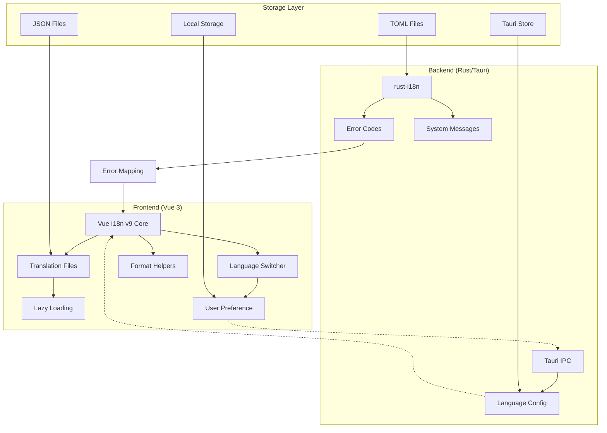
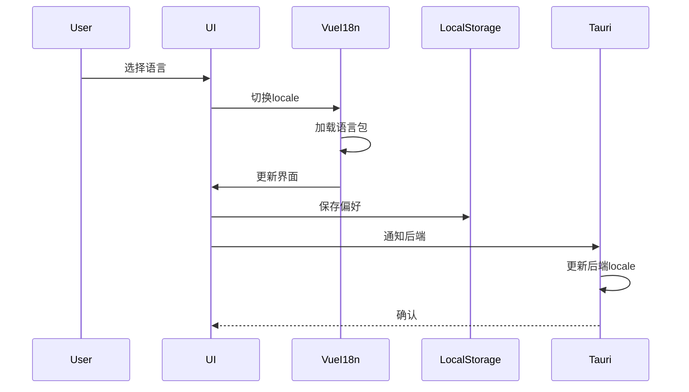
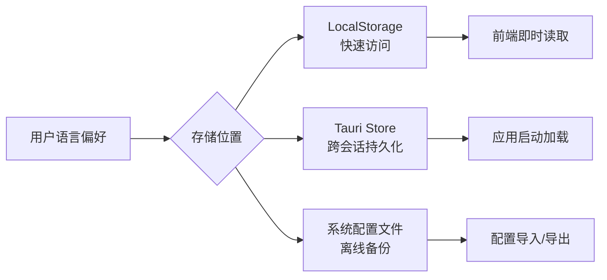
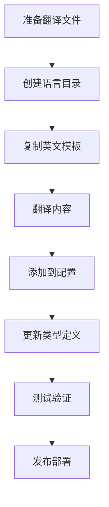
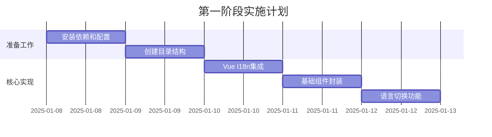

# AI Magnet Assistant 国际化(i18n)系统架构设计

## 目录

1. [架构概览](#架构概览)
2. [前端架构设计](#前端架构设计)
3. [后端架构设计](#后端架构设计)
4. [语言包文件结构](#语言包文件结构)
5. [语言切换机制](#语言切换机制)
6. [持久化存储方案](#持久化存储方案)
7. [扩展性设计](#扩展性设计)
8. [特殊场景处理](#特殊场景处理)
9. [实施路线图](#实施路线图)

---

## 架构概览

### 系统架构图



### 核心设计原则

1. **分离关注点**: 前端负责UI文本，后端负责系统消息和错误代码
2. **性能优先**: 采用懒加载和代码分割减少初始加载体积
3. **类型安全**: 全程TypeScript支持，确保翻译键的类型安全
4. **渐进式实施**: 支持增量迁移，不破坏现有功能
5. **开发者友好**: 简化的API和清晰的文件组织

---

## 前端架构设计

### 技术栈

- **核心库**: Vue I18n v9.x
- **消息格式**: ICU MessageFormat
- **类型系统**: TypeScript 5.x
- **构建工具**: Vite with i18n plugins

### 架构层次

```text
src/
├── i18n/
│   ├── index.ts                 # i18n实例初始化
│   ├── config.ts                 # 配置常量
│   ├── types/
│   │   ├── index.d.ts           # 全局类型定义
│   │   ├── schema.ts             # 消息结构Schema
│   │   └── locale.ts             # 语言相关类型
│   ├── locales/
│   │   ├── en/                  # 英文语言包
│   │   │   ├── index.ts         # 模块导出
│   │   │   ├── common.json      # 通用文本
│   │   │   ├── pages/           # 页面级翻译
│   │   │   │   ├── home.json
│   │   │   │   ├── settings.json
│   │   │   │   └── favorites.json
│   │   │   ├── components/      # 组件级翻译
│   │   │   │   ├── navigation.json
│   │   │   │   └── resultCard.json
│   │   │   ├── messages/        # 系统消息
│   │   │   │   ├── errors.json
│   │   │   │   ├── success.json
│   │   │   │   └── warnings.json
│   │   │   └── formats.json     # 格式化规则
│   │   └── zh-CN/               # 中文语言包（同结构）
│   ├── utils/
│   │   ├── formatter.ts         # 格式化工具
│   │   ├── detector.ts          # 语言检测
│   │   ├── validator.ts         # 翻译验证
│   │   └── fallback.ts          # 回退机制
│   └── composables/
│       ├── useI18n.ts           # 增强的i18n组合式函数
│       ├── useLocale.ts         # 语言切换逻辑
│       └── useTranslation.ts    # 翻译助手
```

### 核心模块设计

#### 1. i18n实例初始化 (`i18n/index.ts`)

```typescript
import { createI18n } from 'vue-i18n'
import { detectUserLocale } from './utils/detector'
import { loadLocaleMessages } from './utils/loader'
import type { I18nOptions } from './types'

const DEFAULT_LOCALE = 'en'
const SUPPORTED_LOCALES = ['en', 'zh-CN', 'ja', 'ko', 'es', 'fr']

export async function setupI18n(): Promise<I18n> {
  const locale = await detectUserLocale()
  const messages = await loadLocaleMessages(locale)

  const i18n = createI18n({
    legacy: false,
    locale,
    fallbackLocale: DEFAULT_LOCALE,
    messages,
    globalInjection: true,
    missingWarn: import.meta.env.DEV,
    fallbackWarn: import.meta.env.DEV,
    formatFallbackMessages: true,
    modifiers: {
      // 自定义修饰符
      snakeCase: (str: string) => str.replace(/\s/g, '_').toLowerCase(),
      camelCase: (str: string) => str.replace(/\s(.)/g, (_, c) => c.toUpperCase())
    },
    datetimeFormats: {
      // 日期时间格式定义
    },
    numberFormats: {
      // 数字格式定义
    }
  })

  return i18n
}
```

#### 2. 类型定义系统 (`i18n/types/schema.ts`)

```typescript
// 消息结构的类型定义
export interface MessageSchema {
  common: {
    app: {
      name: string
      version: string
      description: string
    }
    actions: {
      save: string
      cancel: string
      delete: string
      edit: string
      search: string
      refresh: string
      // ...
    }
  }
  pages: {
    home: HomePageMessages
    settings: SettingsPageMessages
    favorites: FavoritesPageMessages
    // ...
  }
  components: {
    navigation: NavigationMessages
    resultCard: ResultCardMessages
    // ...
  }
  messages: {
    errors: Record<string, string>
    success: Record<string, string>
    warnings: Record<string, string>
  }
}

// 使用类型安全的翻译键
export type TranslationKey = DeepKeys<MessageSchema>
```

#### 3. 智能组合式函数 (`i18n/composables/useI18n.ts`)

```typescript
import { useI18n as vueUseI18n } from 'vue-i18n'
import type { TranslationKey } from '../types/schema'

export function useI18n() {
  const { t, d, n, locale, ...rest } = vueUseI18n()

  // 增强的翻译函数，带类型检查
  const translate = (key: TranslationKey, params?: Record<string, any>) => {
    return t(key, params)
  }

  // 智能复数处理
  const plural = (key: TranslationKey, count: number, params?: Record<string, any>) => {
    return t(key, { count, ...params })
  }

  // 带回退的翻译
  const safeTranslate = (key: TranslationKey, fallback: string, params?: Record<string, any>) => {
    try {
      const translation = t(key, params)
      return translation !== key ? translation : fallback
    } catch {
      return fallback
    }
  }

  // HTML内容翻译
  const translateHtml = (key: TranslationKey, params?: Record<string, any>) => {
    return t(key, params).replace(/\n/g, '<br/>')
  }

  return {
    ...rest,
    t: translate,
    plural,
    safeTranslate,
    translateHtml,
    locale,
    d,
    n
  }
}
```

---

## 后端架构设计

### 技术选型

- **主要库**: rust-i18n 或 fluent-rs
- **错误映射**: 自定义错误代码系统
- **配置格式**: TOML/JSON

### 架构结构

```text
src-tauri/
├── src/
│   ├── i18n/
│   │   ├── mod.rs               # i18n模块入口
│   │   ├── config.rs            # 配置管理
│   │   ├── error_codes.rs       # 错误代码定义
│   │   ├── messages.rs          # 系统消息
│   │   └── translator.rs        # 翻译逻辑
│   ├── locales/
│   │   ├── en.toml              # 英文消息
│   │   └── zh-CN.toml           # 中文消息
│   └── errors/
│       └── mapping.rs           # 错误映射逻辑
```

### 错误代码系统设计

```rust
// src-tauri/src/i18n/error_codes.rs

use serde::{Deserialize, Serialize};

#[derive(Debug, Serialize, Deserialize, Clone)]
pub enum ErrorCode {
    // 搜索相关
    SearchNoEngines,
    SearchTimeout,
    SearchFailed(String),

    // 收藏相关
    FavoritesDuplicate,
    FavoritesNotFound,
    FavoritesQuotaExceeded,

    // 引擎相关
    EngineNotFound,
    EngineNotDeletable,
    EngineInvalid,

    // 系统相关
    SystemIOError,
    SystemPermissionDenied,
    SystemNetworkError,

    // AI服务相关
    AIServiceUnavailable,
    AIServiceQuotaExceeded,
    AIServiceInvalidKey,
}

impl ErrorCode {
    pub fn to_string(&self) -> String {
        match self {
            ErrorCode::SearchNoEngines => "ERR_SEARCH_NO_ENGINES".to_string(),
            ErrorCode::FavoritesDuplicate => "ERR_FAVORITES_DUPLICATE".to_string(),
            // ... 其他映射
        }
    }

    pub fn to_frontend_message(&self) -> FrontendError {
        FrontendError {
            code: self.to_string(),
            params: self.get_params(),
        }
    }
}

#[derive(Serialize, Deserialize)]
pub struct FrontendError {
    pub code: String,
    pub params: Option<HashMap<String, String>>,
}
```

### Tauri IPC通信设计

```rust
// src-tauri/src/i18n/mod.rs

use tauri::State;

#[tauri::command]
pub async fn get_system_locale() -> Result<String, String> {
    // 获取系统语言设置
    let locale = sys_locale::get_locale()
        .unwrap_or_else(|| "en".to_string());
    Ok(locale)
}

#[tauri::command]
pub async fn set_app_locale(
    locale: String,
    state: State<'_, AppState>
) -> Result<(), String> {
    // 保存语言设置到应用状态
    state.set_locale(locale).await
        .map_err(|e| e.to_string())
}

#[tauri::command]
pub async fn translate_error(
    error_code: String,
    locale: String
) -> Result<String, String> {
    // 后端错误消息翻译（如果需要）
    Ok(translate_backend_error(&error_code, &locale))
}
```

---

## 语言包文件结构

### 前端语言包组织原则

1. **模块化分离**: 按页面、组件、消息类型分离
2. **扁平化键名**: 避免超过3层嵌套
3. **命名规范**:
   - 页面: `pages.{pageName}.{section}.{element}`
   - 组件: `components.{componentName}.{element}`
   - 消息: `messages.{type}.{code}`

### 示例语言包文件

#### `locales/en/pages/home.json`

```json
{
  "title": "AI Magnet Assistant",
  "search": {
    "placeholder": "Enter search keywords...",
    "button": "Search",
    "advancedButton": "Advanced Search",
    "status": {
      "idle": "Ready to search",
      "searching": "Searching on {engine}...",
      "found": "Found {count} result | Found {count} results",
      "analyzing": "AI analyzing {current}/{total} results...",
      "complete": "Search complete"
    },
    "filters": {
      "all": "All",
      "highQuality": "High Quality",
      "recent": "Recent",
      "popular": "Popular"
    }
  },
  "results": {
    "empty": "No results found",
    "loadMore": "Load More",
    "endOfList": "End of results"
  }
}
```

#### `locales/zh-CN/pages/home.json`

```json
{
  "title": "AI 磁力助手",
  "search": {
    "placeholder": "请输入搜索关键词...",
    "button": "搜索",
    "advancedButton": "高级搜索",
    "status": {
      "idle": "准备就绪",
      "searching": "正在 {engine} 搜索...",
      "found": "找到 {count} 个结果",
      "analyzing": "AI 分析中 {current}/{total}...",
      "complete": "搜索完成"
    },
    "filters": {
      "all": "全部",
      "highQuality": "高质量",
      "recent": "最新",
      "popular": "热门"
    }
  },
  "results": {
    "empty": "未找到结果",
    "loadMore": "加载更多",
    "endOfList": "已加载全部"
  }
}
```

### 后端语言包格式

#### `src-tauri/locales/en.toml`

```toml
[errors]
search_no_engines = "No search engines available for this operation."
favorites_duplicate = "This item is already in your favorites."
favorites_not_found = "Favorite item not found."
engine_not_deletable = "Cannot delete the default search engine."

[system]
app_starting = "Application is starting..."
app_ready = "Application is ready."
update_available = "A new version is available."
```

---

## 语言切换机制

### 前端语言切换流程



### 实现代码

#### 语言切换组件

```vue
<!-- src/components/LanguageSwitcher.vue -->
<template>
  <div class="language-switcher">
    <select v-model="currentLocale" @change="onLocaleChange">
      <option v-for="locale in availableLocales" :key="locale.code" :value="locale.code">
        {{ locale.name }}
      </option>
    </select>
  </div>
</template>

<script setup lang="ts">
import { ref, computed } from 'vue'
import { useLocale } from '@/i18n/composables/useLocale'

const { locale, setLocale, availableLocales } = useLocale()

const currentLocale = computed({
  get: () => locale.value,
  set: (value) => setLocale(value)
})

const onLocaleChange = async () => {
  // 触发语言切换
  await setLocale(currentLocale.value)
}
</script>
```

#### useLocale组合式函数

```typescript
// src/i18n/composables/useLocale.ts
import { ref, watchEffect } from 'vue'
import { useI18n } from 'vue-i18n'
import { invoke } from '@tauri-apps/api/tauri'

export function useLocale() {
  const { locale: i18nLocale, availableLocales: i18nAvailableLocales } = useI18n()

  const setLocale = async (newLocale: string) => {
    // 1. 更新Vue I18n
    i18nLocale.value = newLocale

    // 2. 保存到本地存储
    localStorage.setItem('app-locale', newLocale)

    // 3. 通知后端
    try {
      await invoke('set_app_locale', { locale: newLocale })
    } catch (error) {
      console.error('Failed to update backend locale:', error)
    }

    // 4. 动态加载语言包（如果使用懒加载）
    if (!i18nAvailableLocales.includes(newLocale)) {
      const messages = await import(`../locales/${newLocale}/index.ts`)
      i18n.global.setLocaleMessage(newLocale, messages.default)
    }

    // 5. 更新HTML lang属性
    document.documentElement.lang = newLocale
  }

  const availableLocales = [
    { code: 'en', name: 'English' },
    { code: 'zh-CN', name: '简体中文' },
    { code: 'ja', name: '日本語' },
    { code: 'ko', name: '한국어' },
    { code: 'es', name: 'Español' },
    { code: 'fr', name: 'Français' }
  ]

  return {
    locale: i18nLocale,
    setLocale,
    availableLocales
  }
}
```

---

## 持久化存储方案

### 存储层次设计



### 实现方案

#### 1. 前端LocalStorage

```typescript
// src/i18n/utils/storage.ts
const STORAGE_KEY = 'ai-magnet-locale'

export class LocaleStorage {
  static get(): string | null {
    return localStorage.getItem(STORAGE_KEY)
  }

  static set(locale: string): void {
    localStorage.setItem(STORAGE_KEY, locale)
  }

  static remove(): void {
    localStorage.removeItem(STORAGE_KEY)
  }
}
```

#### 2. Tauri Store持久化

```rust
// src-tauri/src/i18n/config.rs
use tauri_plugin_store::{Store, StoreBuilder};
use serde::{Deserialize, Serialize};

#[derive(Serialize, Deserialize, Default)]
pub struct I18nConfig {
    pub locale: String,
    pub fallback_locale: String,
    pub auto_detect: bool,
}

impl I18nConfig {
    pub fn load(app_handle: &tauri::AppHandle) -> Result<Self, String> {
        let store = StoreBuilder::new(app_handle, "i18n.json".parse()?)
            .build();

        match store.get("config") {
            Some(config) => Ok(serde_json::from_value(config).unwrap_or_default()),
            None => Ok(Self::default()),
        }
    }

    pub fn save(&self, app_handle: &tauri::AppHandle) -> Result<(), String> {
        let mut store = StoreBuilder::new(app_handle, "i18n.json".parse()?)
            .build();

        store.insert("config", serde_json::to_value(self)?)?;
        store.save()?;
        Ok(())
    }
}
```

#### 3. 初始化时的语言检测优先级

```typescript
// src/i18n/utils/detector.ts
export async function detectUserLocale(): Promise<string> {
  // 优先级顺序：
  // 1. URL参数（用于测试）
  const urlParams = new URLSearchParams(window.location.search)
  const urlLocale = urlParams.get('locale')
  if (urlLocale && isSupported(urlLocale)) {
    return urlLocale
  }

  // 2. LocalStorage中的用户偏好
  const savedLocale = LocaleStorage.get()
  if (savedLocale && isSupported(savedLocale)) {
    return savedLocale
  }

  // 3. Tauri Store中的持久化配置
  try {
    const backendLocale = await invoke<string>('get_saved_locale')
    if (backendLocale && isSupported(backendLocale)) {
      return backendLocale
    }
  } catch (error) {
    console.warn('Failed to get backend locale:', error)
  }

  // 4. 浏览器语言设置
  const browserLocale = navigator.language
  if (isSupported(browserLocale)) {
    return browserLocale
  }

  // 5. 浏览器语言列表中的第一个支持的语言
  for (const lang of navigator.languages) {
    const normalized = normalizeLocale(lang)
    if (isSupported(normalized)) {
      return normalized
    }
  }

  // 6. 默认语言
  return 'en'
}
```

---

## 扩展性设计

### 1. 新语言添加流程



#### 自动化脚本

```typescript
// scripts/add-language.ts
import fs from 'fs'
import path from 'path'

async function addLanguage(langCode: string, langName: string) {
  // 1. 创建目录结构
  const localeDir = path.join('src/i18n/locales', langCode)
  fs.mkdirSync(localeDir, { recursive: true })

  // 2. 复制模板文件
  const templateDir = path.join('src/i18n/locales', 'en')
  copyDirectory(templateDir, localeDir)

  // 3. 更新配置
  updateI18nConfig(langCode, langName)

  // 4. 生成类型定义
  generateTypes(langCode)

  console.log(`Language ${langName} (${langCode}) has been added successfully!`)
  console.log(`Please translate the files in ${localeDir}`)
}

// 使用: npm run add-language -- --code=de --name=Deutsch
```

### 2. 翻译键命名规范

```typescript
// docs/i18n-naming-convention.md
/**
 * 命名规范：
 *
 * 1. 页面级别: pages.{pageName}.{section}.{element}
 *    示例: pages.home.search.button
 *
 * 2. 组件级别: components.{componentName}.{element}
 *    示例: components.navigation.title
 *
 * 3. 通用文本: common.{category}.{item}
 *    示例: common.actions.save
 *
 * 4. 消息类型: messages.{type}.{code}
 *    示例: messages.errors.network_error
 *
 * 5. 格式化: formats.{type}.{name}
 *    示例: formats.date.short
 */
```

### 3. 组件级别的i18n封装

```vue
<!-- src/components/base/I18nText.vue -->
<template>
  <component :is="tag" v-bind="$attrs">
    <slot v-if="$slots.default" />
    <template v-else>{{ translatedText }}</template>
  </component>
</template>

<script setup lang="ts">
import { computed } from 'vue'
import { useI18n } from '@/i18n/composables/useI18n'

interface Props {
  tKey: string
  params?: Record<string, any>
  tag?: string
  fallback?: string
}

const props = withDefaults(defineProps<Props>(), {
  tag: 'span'
})

const { t, safeTranslate } = useI18n()

const translatedText = computed(() => {
  if (props.fallback) {
    return safeTranslate(props.tKey, props.fallback, props.params)
  }
  return t(props.tKey, props.params)
})
</script>
```

### 4. 动态内容处理策略

```typescript
// src/i18n/utils/dynamic.ts

export class DynamicContentHandler {
  // 处理来自后端的动态内容
  static handleBackendContent(content: string, locale: string): string {
    // 检查是否包含翻译标记
    if (content.startsWith('@@')) {
      const key = content.substring(2)
      return i18n.global.t(key)
    }
    return content
  }

  // 处理富文本内容
  static handleRichContent(html: string, locale: string): string {
    // 替换内联翻译标记
    return html.replace(/\{\{t:([^}]+)\}\}/g, (match, key) => {
      return i18n.global.t(key)
    })
  }

  // 处理动态加载的内容
  static async handleAsyncContent(
    loader: () => Promise<string>,
    locale: string
  ): Promise<string> {
    const content = await loader()
    return this.handleBackendContent(content, locale)
  }
}
```

---

## 特殊场景处理

### 1. 复数形式处理

```json
// locales/en/common.json
{
  "items": {
    "count": "You have no items | You have one item | You have {count} items"
  },
  "results": {
    "found": "No results found | Found {n} result | Found {n} results"
  }
}
```

```typescript
// 使用示例
const { plural } = useI18n()

// 自动选择正确的复数形式
const message = plural('items.count', itemCount)
```

### 2. 日期/时间格式化

```typescript
// src/i18n/formats/datetime.ts
export const datetimeFormats = {
  'en': {
    short: {
      year: 'numeric',
      month: 'short',
      day: 'numeric'
    },
    long: {
      year: 'numeric',
      month: 'long',
      day: 'numeric',
      weekday: 'long',
      hour: 'numeric',
      minute: 'numeric'
    },
    time: {
      hour: 'numeric',
      minute: 'numeric',
      second: 'numeric'
    }
  },
  'zh-CN': {
    short: {
      year: 'numeric',
      month: 'numeric',
      day: 'numeric'
    },
    long: {
      year: 'numeric',
      month: 'long',
      day: 'numeric',
      weekday: 'long',
      hour: 'numeric',
      minute: 'numeric',
      hour12: false
    },
    time: {
      hour: 'numeric',
      minute: 'numeric',
      second: 'numeric',
      hour12: false
    }
  }
}
```

### 3. 数字格式化

```typescript
// src/i18n/formats/number.ts
export const numberFormats = {
  'en': {
    currency: {
      style: 'currency',
      currency: 'USD',
      minimumFractionDigits: 2
    },
    decimal: {
      minimumFractionDigits: 2,
      maximumFractionDigits: 2
    },
    percent: {
      style: 'percent',
      minimumFractionDigits: 0
    },
    fileSize: {
      // 自定义格式化器
      formatter: (bytes: number) => {
        const units = ['B', 'KB', 'MB', 'GB', 'TB']
        let size = bytes
        let unitIndex = 0
        while (size >= 1024 && unitIndex < units.length - 1) {
          size /= 1024
          unitIndex++
        }
        return `${size.toFixed(2)} ${units[unitIndex]}`
      }
    }
  },
  'zh-CN': {
    currency: {
      style: 'currency',
      currency: 'CNY'
    },
    // ... 其他格式
  }
}
```

### 4. HTML内容国际化

```vue
<!-- 使用v-html指令处理HTML内容 -->
<template>
  <div class="content">
    <!-- 简单HTML -->
    <p v-html="$t('about.description')"></p>

    <!-- 复杂HTML with参数 -->
    <div v-html="$t('about.features', {
      version: appVersion,
      author: authorName
    })"></div>

    <!-- 使用组件处理安全HTML -->
    <SafeHtml :content="$t('about.content')" :sanitize="true" />
  </div>
</template>

<script setup lang="ts">
import SafeHtml from '@/components/base/SafeHtml.vue'
import { useI18n } from '@/i18n/composables/useI18n'

const { t } = useI18n()
const appVersion = '1.2.0'
const authorName = 'AI Magnet Team'
</script>
```

### 5. 错误消息映射

```typescript
// src/i18n/utils/errorMapper.ts
export class ErrorMapper {
  private static errorMap = new Map([
    ['ERR_SEARCH_NO_ENGINES', 'messages.errors.search_no_engines'],
    ['ERR_FAVORITES_DUPLICATE', 'messages.errors.favorites_duplicate'],
    ['ERR_NETWORK_ERROR', 'messages.errors.network_error'],
    // ... 更多映射
  ])

  static mapError(errorCode: string, params?: Record<string, any>): string {
    const messageKey = this.errorMap.get(errorCode)
    if (!messageKey) {
      console.warn(`Unknown error code: ${errorCode}`)
      return i18n.global.t('messages.errors.unknown', { code: errorCode })
    }

    return i18n.global.t(messageKey, params)
  }

  static mapBackendError(error: BackendError): string {
    return this.mapError(error.code, error.params)
  }
}

// 使用示例
catch (error) {
  if (error instanceof BackendError) {
    const message = ErrorMapper.mapBackendError(error)
    showToast(message, 'error')
  }
}
```

---

## 实施路线图

### 第一阶段：基础架构搭建（2-3天）



**任务清单：**

- [ ] 安装 vue-i18n@9 和相关依赖
- [ ] 创建 i18n 目录结构
- [ ] 配置 TypeScript 类型定义
- [ ] 实现 i18n 初始化逻辑
- [ ] 创建语言切换组件
- [ ] 实现持久化存储

### 第二阶段：前端文本迁移（5-7天）

**任务清单：**

- [ ] 提取所有硬编码文本
- [ ] 创建英文语言包
- [ ] 组件模板文本替换
- [ ] 动态消息处理
- [ ] 格式化配置
- [ ] 单元测试

### 第三阶段：后端集成（3-4天）

**任务清单：**

- [ ] 实现错误代码系统
- [ ] 创建错误映射逻辑
- [ ] Tauri IPC通信
- [ ] 后端语言配置
- [ ] 系统消息处理

### 第四阶段：翻译和优化（4-5天）

**任务清单：**

- [ ] 完成中文翻译
- [ ] 添加其他语言支持
- [ ] 性能优化（懒加载）
- [ ] 完整性测试
- [ ] 文档更新

### 第五阶段：高级功能（可选，3-4天）

**任务清单：**

- [ ] 实现翻译管理界面
- [ ] 添加在线翻译更新
- [ ] 实现A/B测试支持
- [ ] 添加翻译分析工具
- [ ] 集成第三方翻译服务

---

## 性能优化策略

### 1. 懒加载实现

```typescript
// src/i18n/utils/loader.ts
export async function loadLocaleMessages(locale: string) {
  // 基础消息总是加载
  const baseMessages = await import(`../locales/${locale}/common.json`)

  // 根据路由懒加载页面消息
  const loadPageMessages = async (pageName: string) => {
    try {
      const module = await import(`../locales/${locale}/pages/${pageName}.json`)
      return module.default
    } catch {
      console.warn(`Page messages not found: ${pageName}`)
      return {}
    }
  }

  return {
    common: baseMessages.default,
    // 页面消息按需加载
    pages: new Proxy({}, {
      get(target, prop: string) {
        if (!target[prop]) {
          target[prop] = loadPageMessages(prop)
        }
        return target[prop]
      }
    })
  }
}
```

### 2. 缓存策略

```typescript
// src/i18n/utils/cache.ts
export class TranslationCache {
  private cache = new Map<string, string>()
  private maxSize = 1000

  get(key: string, locale: string): string | undefined {
    return this.cache.get(`${locale}:${key}`)
  }

  set(key: string, locale: string, value: string): void {
    const cacheKey = `${locale}:${key}`

    // LRU缓存策略
    if (this.cache.size >= this.maxSize) {
      const firstKey = this.cache.keys().next().value
      this.cache.delete(firstKey)
    }

    this.cache.set(cacheKey, value)
  }

  clear(): void {
    this.cache.clear()
  }
}
```

---

## 测试策略

### 1. 单元测试

```typescript
// tests/i18n/translation.spec.ts
import { describe, it, expect } from 'vitest'
import { setupI18n } from '@/i18n'

describe('i18n Translation', () => {
  it('should translate simple key', async () => {
    const i18n = await setupI18n()
    const translated = i18n.global.t('common.actions.save')
    expect(translated).toBe('Save')
  })

  it('should handle missing translation', async () => {
    const i18n = await setupI18n()
    const translated = i18n.global.t('non.existent.key')
    expect(translated).toBe('non.existent.key')
  })

  it('should format message with parameters', async () => {
    const i18n = await setupI18n()
    const translated = i18n.global.t('pages.home.search.status.found', { count: 5 })
    expect(translated).toBe('Found 5 results')
  })
})
```

### 2. 集成测试

```typescript
// tests/i18n/integration.spec.ts
import { mount } from '@vue/test-utils'
import { createI18n } from 'vue-i18n'
import LanguageSwitcher from '@/components/LanguageSwitcher.vue'

describe('Language Switcher', () => {
  it('should switch language', async () => {
    const wrapper = mount(LanguageSwitcher, {
      global: {
        plugins: [i18n]
      }
    })

    const select = wrapper.find('select')
    await select.setValue('zh-CN')

    expect(i18n.global.locale.value).toBe('zh-CN')
    expect(localStorage.getItem('app-locale')).toBe('zh-CN')
  })
})
```

---

## 监控和分析

### 翻译覆盖率检查

```typescript
// scripts/check-translations.ts
import fs from 'fs'
import path from 'path'

function checkTranslationCoverage() {
  const baseLocale = 'en'
  const targetLocales = ['zh-CN', 'ja', 'ko']

  const baseKeys = extractKeys(`src/i18n/locales/${baseLocale}`)

  for (const locale of targetLocales) {
    const localeKeys = extractKeys(`src/i18n/locales/${locale}`)
    const missing = baseKeys.filter(key => !localeKeys.includes(key))

    if (missing.length > 0) {
      console.warn(`Missing translations in ${locale}:`)
      missing.forEach(key => console.warn(`  - ${key}`))
    }

    const coverage = ((localeKeys.length / baseKeys.length) * 100).toFixed(2)
    console.log(`${locale} coverage: ${coverage}%`)
  }
}
```

---

## 结论

本架构设计提供了一个完整、可扩展、高性能的国际化解决方案。通过Vue I18n v9与Rust后端的深度集成，实现了：

1. **完整的类型安全**：TypeScript贯穿整个i18n系统
2. **优异的性能**：懒加载、缓存、代码分割
3. **卓越的开发体验**：清晰的API、自动化工具
4. **强大的扩展性**：轻松添加新语言和功能
5. **全面的测试覆盖**：单元测试、集成测试、覆盖率检查

该架构为AI Magnet Assistant项目的全球化奠定了坚实基础。

---

*文档版本: 1.2.0*
*创建日期: 2025-01-07*
*作者: AI Magnet Assistant Architecture Team*
